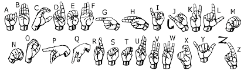
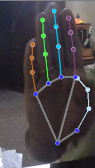
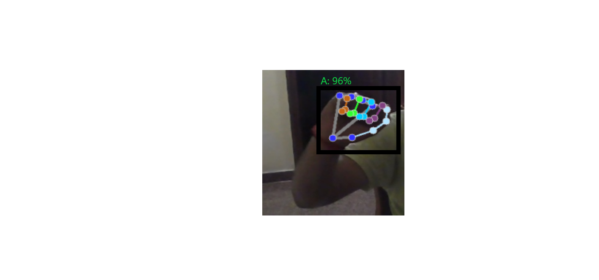

# Sign Language to Text Using MediaPipe, CV and Machine Learning.

## Table of Contents

1. [About The Project](#about-the-project)
   - [Built With](#built-with)
2. [Getting Started](#getting-started)
   - [Prerequisites](#prerequisites)
   - [Installation](#installation)
3. [Usage](#usage)
4. [References](#references)
5. [Contact](#contact)

---

## About The Project
Hand gestures, the language of the deaf community, contain a wealth of information. Automatically extracting and interpreting this information has long been a challenge in computer vision. This project uses computer vision, MediaPipe, and deep learning models to develop a sign-to-text conversion system.

MediaPipe Hand Landmarks refer to a set of 21 key points on a human hand, detected by a machine learning model within the MediaPipe framework. These landmarks allow for precise tracking of hand movements by identifying locations such as fingertips, wrist joints, and the palm center, enabling applications like gesture recognition and hand interaction in augmented reality. Using MediaPipe, hand gestures and finger positions are easily tracked. Based on the positions of these key points, a model is trained to predict alphabetic characters.

Computer vision libraries like OpenCV are used to access images from a webcam. These libraries also provide the added advantage of processing video streams from the camera and individual frames as images.  Image processing capabilities include resizing, color conversion, and frame-by-frame processing.

Deep learning/machine learning models, built using Scikit-learn and TensorFlow, use hand landmarks to predict alphabetic characters. In this project, we utilize a Random Forest Classifier.

### Topics Implemented:
- Images Collection/ Data Preparation 
- Feature extraction from the  images 
- Feature Processing 
- Model Training 
- Model Prediction 

---

## Built With

The tools that have been used in the project are:

- **Scikit-learn**
- **Mediapipe**
- **OpenCV**
- **Python**

---

## Getting Started

This project implements a sign language to text conversion system for the American Sign Language (ASL) alphabet using Python, MediaPipe, and machine learning. A custom dataset of 1000 images per sign is created to ensure control over data variations and minimize bias, rather than relying on potentially unsuitable pre-existing datasets. MediaPipe's Hands pipeline extracts 21 3D hand landmarks from each image, providing a robust representation of hand shape. Crucially, landmark coordinates are normalized for position invariance, making the system resilient to hand placement variations within the frame. A Random Forest classifier is trained on this normalized landmark data for ASL sign recognition. The project prioritizes a landmark-based approach over direct image processing due to the challenges of single-hand ASL recognition and variations in hand positioning. Normalization addresses these issues by focusing on relative hand shape. The Random Forest classifier is chosen for its robustness, speed, and suitability for this type of data. This repository provides the code and resources to replicate and extend this sign language recognition system.

### Prerequisites

- **Python 3.7+** (Recommended: 3.8 or 3.9)
- **Open CV** (To Process the images)
- **Media Pipe** (To get the landmarks of the image)
- **Scikit-learn** (For model building)

### Installation

1. **Download Python Packages**  
2. **Download the Essential Libraries given in requirements file**

### Usage
1. **Real-time Translation**
     --The most obvious use is for real-time translation of sign language into text. This allows for immediate communication between deaf individuals and hearing individuals who don't know sign language.
2. **Conversation Facilitation**
    --The system can facilitate conversations in various settings, such as classrooms, workplaces, medical appointments, or social gatherings, by providing a written transcript of the signed communication.

### References
[https://medium.com/@jamescheriyan93/optimization-of-deep-learning-models-for-real-time-sign-language-to-text-conversion-6f9c2de67401](https://medium.com/@jamescheriyan93/optimization-of-deep-learning-models-for-real-time-sign-language-to-text-conversion-6f9c2de67401)

### Contact
### _Pramathesh T S_

**Email ID** - pramatheshts025@gmail.com 
**LinkedIn** - [https://www.linkedin.com/in/pramatheshts1999/](https://www.linkedin.com/in/pramatheshts1999/) 
**GitHub**   - [https://github.com/Pramathesh690/](https://github.com/Pramathesh690/)

